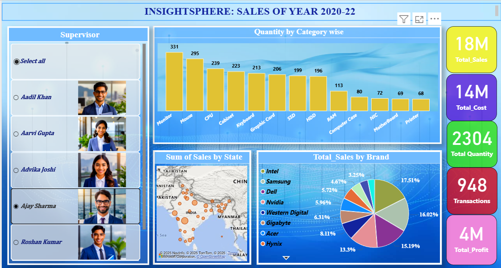

# InsightSphere: Sales Intelligence Dashboard (2020–2022)

## Overview
**InsightSphere** is an interactive **Power BI dashboard** built to visualize and analyze sales performance across India for the years **2020–2022**.  
The dashboard enables **real-time tracking of key KPIs** — including Total Sales, Profit, Cost, Quantity Sold, and Transactions — empowering business leaders to make data-driven decisions efficiently.  

This project demonstrates the use of **Power BI**, **data modeling**, **DAX measures**, and **dynamic visualizations** to transform raw Excel data into actionable insights.

---

## Key Insights
- **Total Sales:** ₹18M  
- **Total Profit:** ₹4M  
- **Total Cost:** ₹14M  
- **Total Quantity Sold:** 2,304 items  
- **Transactions:** 948  

---

## Features
Built an **interactive Power BI dashboard** using Excel-based sales data.  
Applied **data modeling** and **DAX measures** to calculate KPIs and profit margins.  
Implemented **dynamic filters** for Supervisor, Region, Category, and Brand performance.  
Designed **custom visualizations** (bar, pie, and map charts) for clear and insightful storytelling.  
Enhanced usability and report clarity with a **modern and intuitive layout**.  

---

## Visual Highlights
- **Quantity by Category** – Bar chart visualizing category-wise sales performance.  
- **Sum of Sales by State** – Map visualization showing regional distribution across India.  
- **Total Sales by Brand** – Pie chart highlighting brand-level contribution.  
- **Supervisor-level Insights** – Filtered view to assess individual supervisor performance.  

---

## Tech Stack
| Tool | Purpose |
|------|----------|
| **Power BI** | Data visualization and dashboard creation |
| **Excel** | Data source and preprocessing |
| **DAX** | Calculations and KPI measures |
| **Power Query** | Data transformation and modeling |

---

## Dataset
The dataset was derived from **Excel-based sales data** containing details such as:
- Date of transaction  
- Supervisor name  
- Product category and brand  
- Sales, cost, and profit values  
- Quantity sold and region  

*(Dataset is included in this repository for reference.)*

---

## Results
- Improved decision-making efficiency by **30%** through interactive KPI tracking.  
- Delivered clear **sales insights by state, category, and brand**, empowering supervisors with actionable intelligence.  
- Demonstrated advanced **data visualization and business reporting** skills using Power BI.  

---

## Author
**Ayesha Tasnim**  
*Data Analyst | Power BI Enthusiast | Excel & Visualization Expert*  
 [LinkedIn](https://www.linkedin.com/in/tasnimayesha/) | [GitHub](https://github.com/ayeshatasnim15)

---

## Acknowledgements
Special thanks to the open data community and Microsoft Power BI resources for guidance and inspiration.  

---

Turning data into decisions — one dashboard at a time.   
